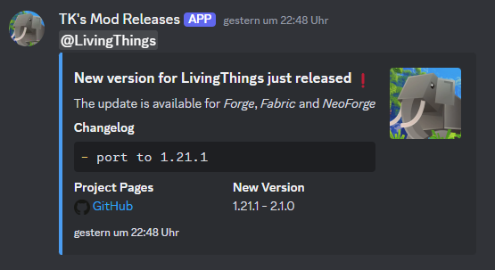

# Example 02

Example usage of this workflow:  
https://github.com/tristankechlo/LivingThings/blob/6371560c8c5d087add61ee2652ee121573cb2665/.github/workflows/build_and_release.yml

## Input

```yaml
- name: Create the discord embed
  uses: tristankechlo/create-discord-embed@v1.0.0
  with:
    released: false
    changelog: "- port to 1.21.1\r\n\r\n**Full Changelog**: https://github.com/tristankechlo/LivingThings/compare/1.21-2.1.0...1.21.1-2.1.0"
    version: "1.21.1 - 2.1.0"
    color: 4037621
    title: "New version for LivingThings just released :exclamation:"
    description: "The update is available for *Forge*, *Fabric* and *NeoForge*"
    curseforge: "https://www.curseforge.com/minecraft/mc-mods/living-things"
    modrinth: "https://modrinth.com/mod/living-things"
    github: "https://github.com/tristankechlo/LivingThings/releases/tag/1.21.1-2.1.0"
    thumbnail: "https://cdn.modrinth.com/data/UKDLi1GJ/d345468b19bfd5ffffa1ed070297a6a74535e9d6.png"
    content: "<@&890143122913370112>" # this is a mention of a discord role
    filename: "embed.json"
    curseforge-emoji: "<:curseforge:938093919848267807>" # will be formatted to the corresponding emoji
    modrinth_emoji: "<:modrinth:977251171980963890>"
    github_emoji: "<:github:938091396785639434>"
    username: "TK's Mod Releases"
    avatar-url: "https://cdn.modrinth.com/data/UKDLi1GJ/d345468b19bfd5ffffa1ed070297a6a74535e9d6.png"
    changelog-split: "**Full Changelog**"
```

## Output

With `released: false`, the curseforge and modrinth links will not be added to the embed.

```json
{
  "username": "TK's Mod Releases",
  "avatar_url": "https://cdn.modrinth.com/data/UKDLi1GJ/d345468b19bfd5ffffa1ed070297a6a74535e9d6.png",
  "embeds": [
    {
      "color": 4037621,
      "thumbnail": {
        "url": "https://cdn.modrinth.com/data/UKDLi1GJ/d345468b19bfd5ffffa1ed070297a6a74535e9d6.png"
      },
      "timestamp": "2024-09-15T20:48:19.522Z",
      "title": "New version for LivingThings just released :exclamation:",
      "description": "The update is available for *Forge*, *Fabric* and *NeoForge*",
      "fields": [
        {
          "name": "Changelog",
          "value": "```md\n- port to 1.21.1\n```",
          "inline": false
        },
        {
          "name": "Project Pages",
          "value": "<:github:938091396785639434> [GitHub](https://github.com/tristankechlo/LivingThings/releases/tag/1.21.1-2.1.0)",
          "inline": true
        },
        {
          "name": "New Version",
          "value": "1.21.1 - 2.1.0",
          "inline": true
        }
      ]
    }
  ],
  "content": "<@&890143122913370112>"
}
```

### actual embed when sent through discord api



